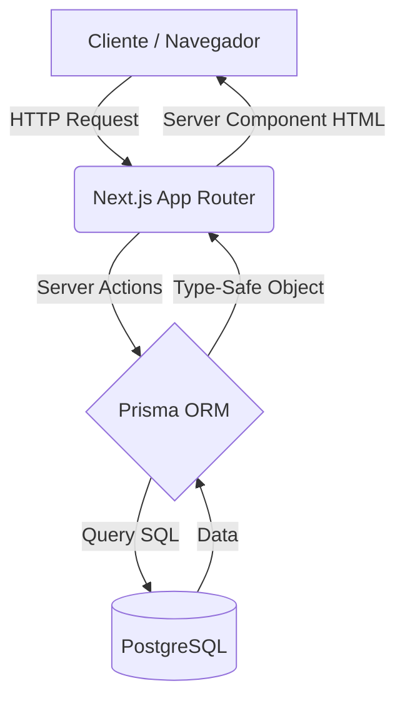
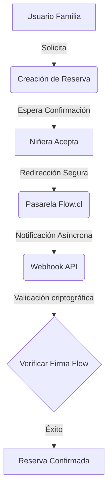

<div align="center">
  <h1>🏠 Refugia</h1>
  <p><strong>Plataforma integral de conexión entre familias y cuidadoras infantiles.</strong></p>
</div>

---

## 🏗️ Arquitectura y Stack Tecnológico

Refugia está construida sobre un stack moderno y escalable enfocado en el rendimiento y la seguridad del lado del servidor.

### Core Stack
* **Next.js 16 (App Router)**: Renderizado híbrido con Server Components para SEO y tiempos de carga óptimos.
* **Server Actions**: Mutaciones de datos directamente desde componentes sin necesidad de endpoints API REST tradicionales.
* **Prisma ORM**: Modelado de datos declarativo y Type-Safety extremo entre la base de datos y la aplicación.
* **PostgreSQL**: Base de datos relacional robusta (migrada desde SQLite para soporte de concurrencia en producción).
* **JWT Authentication**: Sistema sin estado manejado por `NextAuth.js` con contraseñas hasheadas (Bcrypt, 12 rondas).
* **Middleware Authorization**: Protección de rutas en el borde (Edge) evaluando JWTs para interceptar accesos no autorizados antes de renderizar la página.
* **Docker & NGINX**: Contenedorización completa con reverse proxy para orquestación y despliegue rápido.
* **Role Based Access Control (RBAC)**: Segregación estricta de dominios de usuario (`FAMILY`, `NANNY`, `ADMIN`).

---

## 📊 Diagramas de Flujo

### Flujo de Datos y Arquitectura Base


### Ciclo de Vida de Reservas y Pagos


---

## 🎯 Problemas de Ingeniería Resueltos

La plataforma maneja lógicas complejas encapsuladas en un sistema coherente:

* **✓ Matching Geográfico**: Algoritmo de cálculo radial basado en coordenadas anonimizadas para encontrar perfiles dentro del área de cobertura de la niñera.
* **✓ Autenticación e Identidad**: Flujo de registro separado según rol, validando unicidad de emails y hasheo seguro.
* **✓ Roles (RBAC)**: `middleware.ts` en la raíz del proyecto evita accesos cruzados de sesión sin cargar código innecesario.
* **✓ Sistema de Pagos Seguro**: Integración asíncrona mediante webhooks. Soporte para fallas temporales y limpiezas programadas (cron jobs) de pagos estancados.
* **✓ Chat Contextual**: Creación condicional de salas de mensajería (conversations) vinculadas a un ID de reserva, protegiendo la privacidad al permitir chat solo en estados confirmados.
* **✓ Motor de Disponibilidad**: Sistema de intersección de fechas para prevenir "Double Booking" validando horarios de trabajo registrados vs bloques bloqueados manualmente o reservas previas.
* **✓ Contenedorización con Docker**: Orquestación aislada en `docker-compose.yml`, eliminando dependencias locales para la base de datos y unificando las variables de entorno.
* **✓ Transacciones por Emails**: Notificaciones HTML asíncronas vía API (Resend) para eventos clave del ciclo de vida del usuario sin bloquear el renderizado del request HTTP principal.

---

## 🛠️ Instalación y Configuración Local

1. **Clonar el repositorio**
   ```bash
   git clone https://github.com/nicvroyz/nannyconnect.git
   cd nannyconnect
   ```

2. **Variables de Entorno**
   ```bash
   cp .env.example .env
   ```
   *Configura `DATABASE_URL` (Postgres), tu `NEXTAUTH_SECRET`, y claves API.*

3. **Base de Datos (Prisma)**
   ```bash
   npm install
   npx prisma generate
   npx prisma db push
   ```

4. **Levantar el Servidor**
   ```bash
   npm run dev
   ```

## 📦 Deploy (Producción VPS)

Despliegue configurado para `docker-compose`. Levanta la DB de PostgreSQL, la aplicación Next.js compilada y NGINX como reverse proxy.

```bash
# 1. Configurar .env con credenciales de producción
# 2. Levantar los contenedores
docker-compose up -d --build

# 3. Aplicar migraciones en contenedor productivo
docker exec -it nannyconnect_app npx prisma migrate deploy
```

---
> *Desarrollado para resolver la conectividad de cuidados infantiles bajo estrictos estándares de ingeniería de software.*